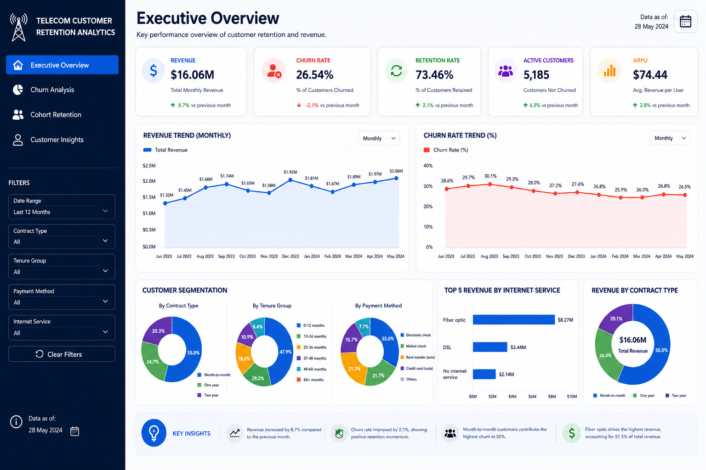
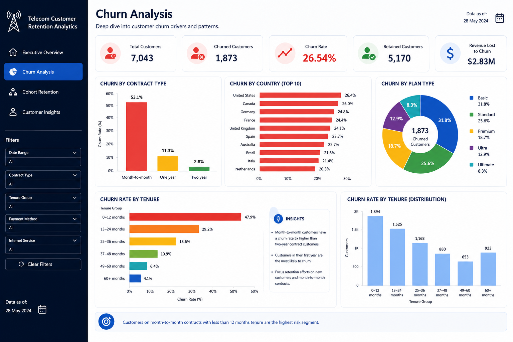
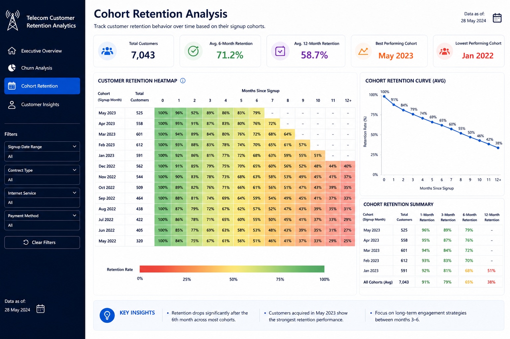
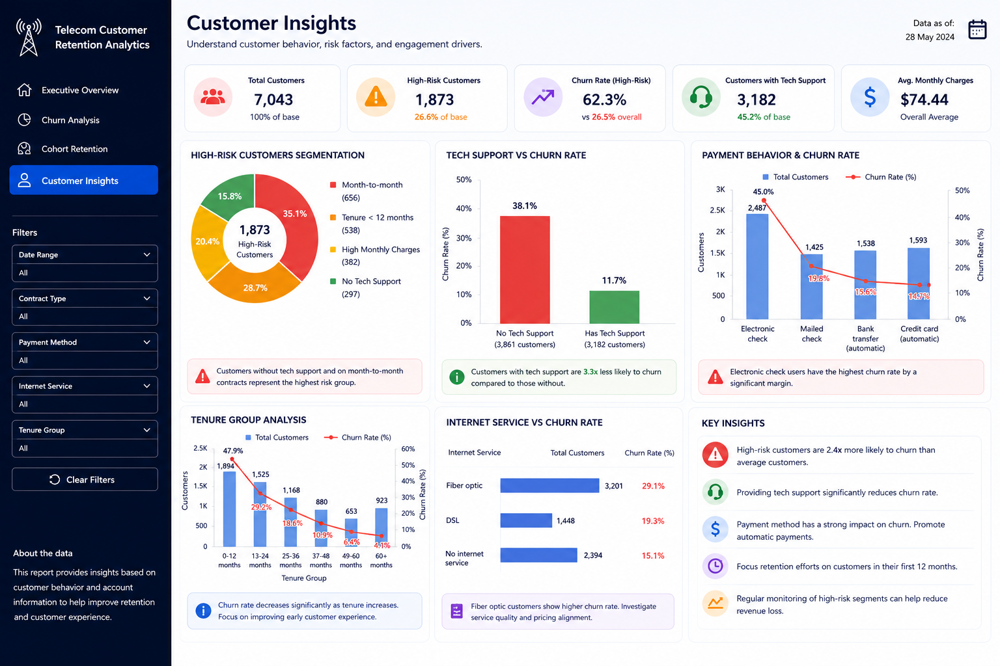
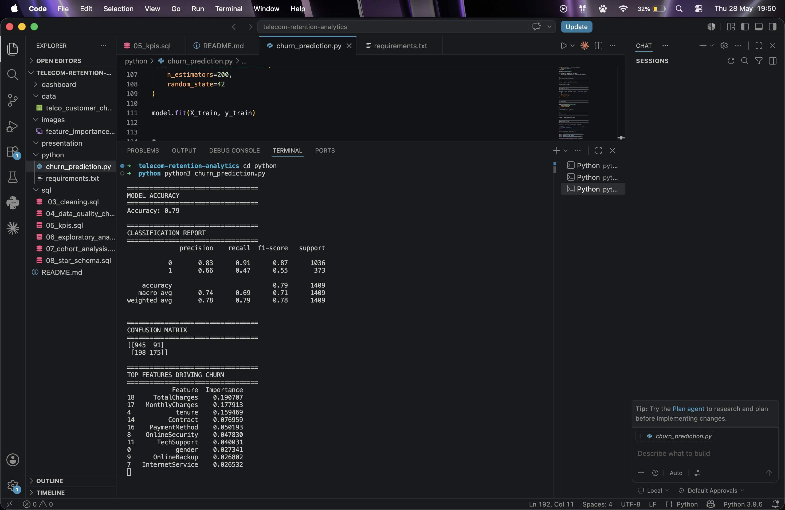
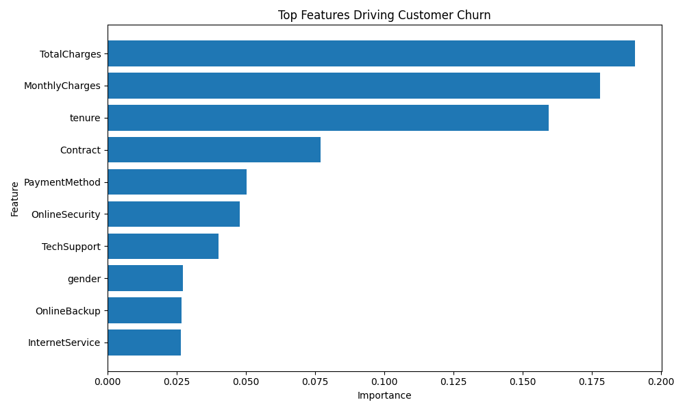

````markdown
# 📊 Telecom Customer Retention Analytics


Enterprise-level end-to-end analytics project focused on customer churn reduction, retention intelligence, and revenue optimization for a telecom/SaaS business environment.

This project combines:

- 🧠 Advanced SQL Analytics
- 📊 Power BI Executive Dashboards
- 🏗️ Star Schema Data Modeling
- 🤖 Predictive Analytics with Machine Learning
- 📈 Customer Retention Intelligence
- 💰 Revenue Optimization Analysis

---

# 📸 Dashboard Preview


---

# 🚨 Business Problem

Telecom companies face significant revenue loss due to customer churn.

The business needed a complete analytics solution capable of:

- 📉 Identifying churn drivers
- 📊 Monitoring customer retention behavior
- 💰 Analyzing revenue impact
- 👥 Segmenting high-risk customers
- 🧠 Supporting executive decision-making
- 🤖 Predicting customer churn risk

This project simulates a real-world enterprise analytics initiative using SQL, Power BI, data modeling, and machine learning.

---

# 🎯 Project Objectives

- Build a complete analytics pipeline
- Clean and transform raw telecom customer data
- Create business KPIs and executive metrics
- Perform churn and retention analysis
- Develop cohort retention analysis
- Design a star schema data model
- Build predictive churn models
- Deliver executive dashboards for stakeholders

---

# 🏗️ Project Architecture

```txt
Raw Dataset
     ↓
SQL Data Cleaning
     ↓
Analytics Layer
     ↓
Star Schema Modeling
     ↓
Business KPI Analysis
     ↓
Cohort Retention Analysis
     ↓
Machine Learning Prediction
     ↓
Power BI Executive Dashboard
```

---

# 🛠️ Tech Stack

| Technology | Purpose |
|---|---|
| 🐬 MySQL | Data storage & SQL analysis |
| 💻 MySQL Workbench | Query execution |
| 🧠 SQL | Data cleaning & business analytics |
| 📈 Power BI | Executive dashboard development |
| 🐍 Python | Predictive analytics |
| 🤖 Scikit-Learn | Machine learning modeling |
| 📊 Matplotlib | Data visualization |
| 📝 VS Code | Project organization |
| 🌐 GitHub | Version control & portfolio |

---

# 📂 Dataset

Dataset used:

- 📁 IBM Telco Customer Churn Dataset

Business context includes:

- customer churn
- subscription services
- contract behavior
- billing analysis
- customer tenure
- revenue intelligence
- retention analysis

---

# 🔄 Data Pipeline

## 1️⃣ Raw Layer

Imported raw telecom customer data into MySQL.

```txt
raw_telco_customers
```

---

## 2️⃣ Cleaning Layer

Created a cleaned analytical table:

```txt
customers_cleaned
```

Cleaning process included:

- ✅ Duplicate validation
- ✅ Null handling
- ✅ Datatype conversion
- ✅ Revenue normalization
- ✅ Churn flag creation
- ✅ Naming standardization

---

## 3️⃣ Analytics Layer

Developed:

- 📊 KPI calculations
- 🔎 Exploratory analysis
- 📉 Churn segmentation
- 🔁 Retention analysis
- 💰 Revenue intelligence
- 📈 Cohort analysis

---

## 4️⃣ Star Schema Modeling

Implemented enterprise-style dimensional modeling.

### ⭐ Fact Table

```txt
fact_customer_metrics
```

### 📦 Dimension Tables

```txt
dim_customer
dim_contract
dim_services
```

---

# 📌 Executive KPIs

Main KPIs developed:

- 📉 Churn Rate
- 🔁 Retention Rate
- 💰 Monthly Revenue
- 🚨 Revenue Lost to Churn
- 👥 Active Customers
- 💵 ARPU (Average Revenue per User)
- 📊 Customer Lifetime Value (LTV)

---

# 📸 Dashboard Pages

## 1️⃣ Executive Overview

- Revenue performance
- Churn trends
- Retention KPIs
- Customer segmentation



---

## 2️⃣ Churn Analysis

- Churn by contract type
- Churn by tenure
- Churn by payment method
- Customer segmentation



---

## 3️⃣ Cohort Retention

- Retention heatmap
- Cohort behavior analysis
- Customer lifecycle retention



---

## 4️⃣ Customer Insights

- High-risk customers
- Support vs churn
- Payment behavior
- Revenue segmentation



---

# 🤖 Predictive Analytics

The project also includes a machine learning churn prediction model using Random Forest Classifier.

Main outputs:

- customer churn prediction
- classification metrics
- feature importance analysis
- churn driver identification

---

## 📊 Model Results



---

## 📈 Feature Importance



---

# 💡 Key Business Insights

## 👥 Customer Retention

- Month-to-month customers presented the highest churn rate.
- Long-term contracts showed significantly better retention.

---

## 💰 Revenue Intelligence

- Fiber optic services generated the highest revenue.
- High-value customers were also associated with elevated churn risk.

---

## 📊 Customer Behavior

- Customers without tech support were substantially more likely to churn.
- Electronic check users showed higher cancellation behavior.

---

## 🔁 Cohort Retention

- Newly acquired customers demonstrated higher churn during early lifecycle stages.
- Retention improved significantly after the first 12 months.

---

# 📈 Business Recommendations

Based on the analysis:

- ✅ Incentivize long-term contracts
- ✅ Improve onboarding experience
- ✅ Expand tech support adoption
- ✅ Target high-risk churn segments
- ✅ Optimize retention campaigns for new customers

---

# 🗂️ Project Structure

```txt
telecom-retention-analytics/
│
├── dashboard/
│   ├── 01_executive_overview.png
│   ├── 02_churn_analysis.png
│   ├── 03_cohort_retention.png
│   ├── 04_customer_insights.png
│   └── telecom_retention_dashboard.pbix
│
├── python/
│   ├── churn_prediction.py
│   └── requirements.txt
│
├── sql/
│   ├── 03_cleaning.sql
│   ├── 04_data_quality_checks.sql
│   ├── 05_kpis.sql
│   ├── 06_exploratory_analysis.sql
│   ├── 07_cohort_analysis.sql
│   └── 08_star_schema.sql
│
├── data/
│   └── telco_customer_churn.csv
│
├── images/
│   ├── dashboard_preview.png
│   ├── feature_importance.png
│   └── model_results.png
│
└── README.md
```

---

# 🚀 How to Run

## 1️⃣ Clone Repository

```bash
git clone https://github.com/yourusername/telecom-retention-analytics.git
```

---

## 2️⃣ Install Python Dependencies

```bash
pip install -r requirements.txt
```

---

## 3️⃣ Open MySQL Workbench

Execute SQL scripts in order:

```txt
03_cleaning.sql
04_data_quality_checks.sql
05_kpis.sql
06_exploratory_analysis.sql
07_cohort_analysis.sql
08_star_schema.sql
```

---

## 4️⃣ Run Machine Learning Model

```bash
python churn_prediction.py
```

---

## 5️⃣ Open Power BI Dashboard

Open:

```txt
telecom_retention_dashboard.pbix
```

Refresh data connection if necessary.

---

# 🧠 Executive Summary

This project demonstrates a complete end-to-end analytics workflow combining:

- 🧠 SQL analytics
- 📊 Business intelligence
- 🏗️ Data modeling
- 🔁 Retention analytics
- 🤖 Machine learning
- 📈 Executive storytelling
- 💻 Power BI dashboarding

The solution simulates a real enterprise analytics project designed to support customer retention and revenue optimization strategies.
````
